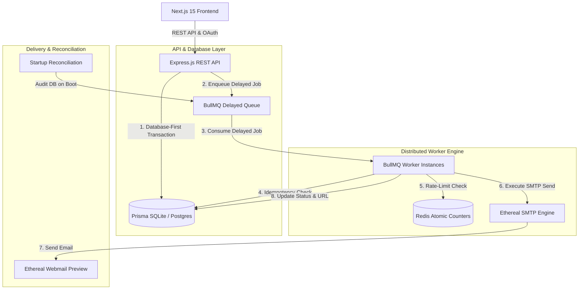

# ReachInbox Production-Grade Email Scheduler Service & Dashboard

A production-grade, high-throughput email scheduling service and executive dashboard built with **Express.js (TypeScript)**, **BullMQ + Redis**, **Prisma (SQLite / PostgreSQL)**, **Ethereal SMTP**, and **Next.js 15 (Tailwind CSS + Lucide Icons)**.

---

## 📋 Table of Contents
- [1. Backend Setup & Run Guide](#1-backend-setup--run-guide)
- [2. Frontend Setup & Run Guide](#2-frontend-setup--run-guide)
- [3. Ethereal Email Setup & Environment Variables](#3-ethereal-email-setup--environment-variables)
- [4. Architecture Overview](#4-architecture-overview)
  - [How Scheduling Works](#how-scheduling-works)
  - [How Persistence on Restart is Handled](#how-persistence-on-restart-is-handled)
  - [How Rate Limiting & Concurrency are Implemented](#how-rate-limiting--concurrency-are-implemented)
- [5. Features Implemented Matrix](#5-features-implemented-matrix)

---

## 1. Backend Setup & Run Guide

The backend runs an **Express REST API** and a **BullMQ Worker Engine**.

### Prerequisites
- Node.js >= 18
- npm >= 9

### Step-by-Step Instructions

1. **Navigate to backend directory & install dependencies**:
   ```bash
   cd backend
   npm install
   ```

2. **Configure Environment Variables**:
   Copy `.env.example` to `.env` in `backend/`:
   ```bash
   cp .env.example .env
   ```

3. **Initialize Database (SQLite / PostgreSQL)**:
   Generate Prisma Client and push schema to database:
   ```bash
   npx prisma generate
   npx prisma db push
   ```

4. **Start Redis**:
   - **Local Redis**: Ensure Redis server is running on `127.0.0.1:6379`.
   - **Cloud Redis**: Provide `REDIS_HOST`, `REDIS_PORT`, and `REDIS_PASSWORD` in `backend/.env`.
   - **Embedded Fallback**: If no Redis server is detected on localhost, an embedded `redis-memory-server` will launch automatically.

5. **Start Backend Server & Worker**:
   ```bash
   npm run dev
   ```
   - **API Server active on**: `http://localhost:5000`
   - **Health Check endpoint**: `http://localhost:5000/health`

---

## 2. Frontend Setup & Run Guide

The frontend is a modern **Next.js 15** web application styling a clean email-client dashboard interface.

### Step-by-Step Instructions

1. **Navigate to frontend directory & install dependencies**:
   ```bash
   cd frontend
   npm install
   ```

2. **Environment Variables**:
   By default, the frontend connects to `http://localhost:5000`. You can optionally create `.env.local` in `frontend/`:
   ```env
   NEXT_PUBLIC_API_URL="http://localhost:5000"
   ```

3. **Run Development Server**:
   ```bash
   npm run dev
   ```
   - **Dashboard active on**: `http://localhost:3000`

4. **Production Build & Verification**:
   ```bash
   npm run build
   npm start
   ```

---

## 3. Ethereal Email Setup & Environment Variables

### What is Ethereal Email?
[Ethereal Email](https://ethereal.email) is a fake SMTP service created by Nodemailer for testing email delivery. Sent emails are not delivered to real inboxes, but instead generate real HTML webmail preview links so you can inspect rendered emails directly.

### Automatic vs Manual Credentials
- **Automatic**: If `ETHEREAL_USER` and `ETHEREAL_PASS` are omitted or blank, Nodemailer automatically generates a fresh test account on server boot and logs the credentials and webmail URL in the terminal!
- **Manual**: Create a free test account at [ethereal.email/create](https://ethereal.email/create) and paste credentials in `backend/.env`.

### Environment Variables Schema (`backend/.env`)

| Variable | Default Value | Description |
| :--- | :--- | :--- |
| `PORT` | `5000` | Express REST API server port |
| `DATABASE_URL` | `"file:./dev.db"` | Relational DB connection string (Prisma SQLite or PostgreSQL) |
| `REDIS_HOST` | `"127.0.0.1"` | Redis host address or cloud endpoint |
| `REDIS_PORT` | `6379` | Redis port number |
| `REDIS_PASSWORD` | `""` | Redis authentication password |
| `WORKER_CONCURRENCY` | `5` | Concurrent job processors per worker instance |
| `MIN_DELAY_BETWEEN_EMAILS_MS` | `2000` | Minimum throttle delay between individual email dispatches (ms) |
| `MAX_EMAILS_PER_HOUR_PER_SENDER` | `10` | Maximum email sends allowed per sender email in a 1-hour window |
| `GOOGLE_CLIENT_ID` | `"demo-client-id"` | Google OAuth 2.0 Client ID |
| `GOOGLE_CLIENT_SECRET` | `"demo-client-secret"` | Google OAuth 2.0 Client Secret |
| `ETHEREAL_USER` | `"test@ethereal.email"` | Ethereal SMTP Username |
| `ETHEREAL_PASS` | `"secret"` | Ethereal SMTP Password |

---

## 4. Architecture Overview



### How Scheduling Works
1. **API Submission**: Client POSTs email payload to `/api/emails/schedule`.
2. **Database-First Transaction**: Every email is first written to the relational database in a `PENDING` or `SCHEDULED` status inside a Prisma transaction. This ensures zero data loss even if Redis is temporarily unreachable.
3. **Delay Calculation**: The server calculates `delayMs = Math.max(0, scheduledAtTimestamp - Date.now())`.
4. **BullMQ Enqueueing**: The job is pushed into the `email-queue` with a deterministic `jobId` (`email-${id}`) and the calculated `delay` parameter. BullMQ stores delayed jobs in a Redis Sorted Set (`ZSET`).

### How Persistence on Restart is Handled
- **Zero Cron Jobs**: The system does not rely on OS `crontab` or `node-cron` timers.
- **Redis ZSET Persistence**: Delayed jobs are stored in Redis sorted sets indexed by timestamp (`score = executionTime`). If the server or worker process restarts, Redis retains all delayed jobs intact.
- **Startup Reconciliation Service (`src/services/reconciliation.ts`)**: On server startup, the reconciliation engine audits all database records marked as `SCHEDULED`. If any job is missing from the BullMQ delayed set, it is automatically re-enqueued to guarantee 100% restart recovery.

### How Rate Limiting & Concurrency are Implemented
- **Worker Concurrency**: Concurrency is managed at the BullMQ worker level (`Worker('email-queue', processor, { concurrency: env.WORKER_CONCURRENCY })`), allowing multiple jobs to be processed concurrently across worker processes.
- **Minimum Throttle Delay**: `MIN_DELAY_BETWEEN_EMAILS_MS` enforces a mandatory minimum pause between consecutive email sends to prevent triggering ISP spam filters.
- **Distributed Hourly Rate Limiting**:
  - Atomic Redis counters are maintained per sender: `rate_limit:{yyyy-mm-dd-hh}:{senderEmail}`.
  - Before sending, the worker increments the key (`INCR`).
  - If the counter exceeds `MAX_EMAILS_PER_HOUR_PER_SENDER`, the job is **not dropped or failed**. Instead, the worker calculates the exact delay until the start of the next hour window and **reschedules the job in BullMQ**, preserving delivery order.

---

## 5. Features Implemented Matrix

### ⚙️ Backend Capabilities
| Feature | Architectural Details & Files |
| :--- | :--- |
| **Scheduler Engine** | Express REST API (`src/controllers/email.controller.ts`) & BullMQ Queue (`src/services/queue.ts`) handling delayed email dispatches. |
| **Database-First Strategy** | Transactional saving in SQLite/PostgreSQL prior to queue insertion (`src/services/email.service.ts`). |
| **Zero Cron Jobs & Persistence** | Delayed job management via Redis `ZSET` without cron timers. |
| **Restart Recovery & Reconciliation** | Automatic startup audit reconciling database records with BullMQ state (`src/services/reconciliation.ts`). |
| **Distributed Rate Limiting** | Atomic hourly Redis counters with non-destructive job rescheduling (`src/services/worker.ts`). |
| **Worker Concurrency & Throttling** | Configurable worker pool (`WORKER_CONCURRENCY`) and minimum inter-email delay (`MIN_DELAY_BETWEEN_EMAILS_MS`). |
| **Idempotency & Retry Safety** | Pre-send status checks preventing duplicate dispatches on retries (`src/services/worker.ts`). |
| **SMTP Delivery & Ethereal Logs** | Nodemailer integration generating Ethereal webmail URLs (`src/services/ethereal.ts`). |

### 🎨 Frontend Capabilities
| Feature | UI Component Details & Files |
| :--- | :--- |
| **Clean Minimal Aesthetic** | Light-theme design system with emerald green accents, amber time badges, and clean typography. |
| **Two-Pane App Shell** | Sidebar with logo, user card, Compose button, CORE nav items (`Scheduled`, `Sent`) with live queue badges (`src/app/page.tsx`). |
| **OAuth & One-Click Demo Login** | Google OAuth authentication and evaluator demo account login (`src/components/auth/GoogleLoginModal.tsx`). |
| **Email Compose & CSV Upload** | Recipient chip tags, PapaParse CSV bulk list import, rich text editor toolbar, delay & limit controls (`src/components/compose/ComposeEmailModal.tsx`). |
| **Send Later Popover** | Anchored date/time picker popover with quick presets (*Tomorrow*, *10:00 AM*, *3:00 PM*). |
| **Tabbed Status Tables** | Filterable, paginated Scheduled and Sent email lists with time badges and cancellation controls (`src/components/dashboard/ScheduledEmailsTable.tsx` & `SentEmailsTable.tsx`). |
| **Email Detail View** | Deep view drawer displaying sender info, email body, yellow callout box, and attachment cards (`src/components/dashboard/EmailDetailView.tsx`). |

---

### 🚀 Running the Full Stack (Single Command)

From the root workspace directory:
```bash
npm run dev
```
- **Frontend Dashboard**: `http://localhost:3000`
- **Backend API Server**: `http://localhost:5000`
- **API Health Check**: `http://localhost:5000/health`
